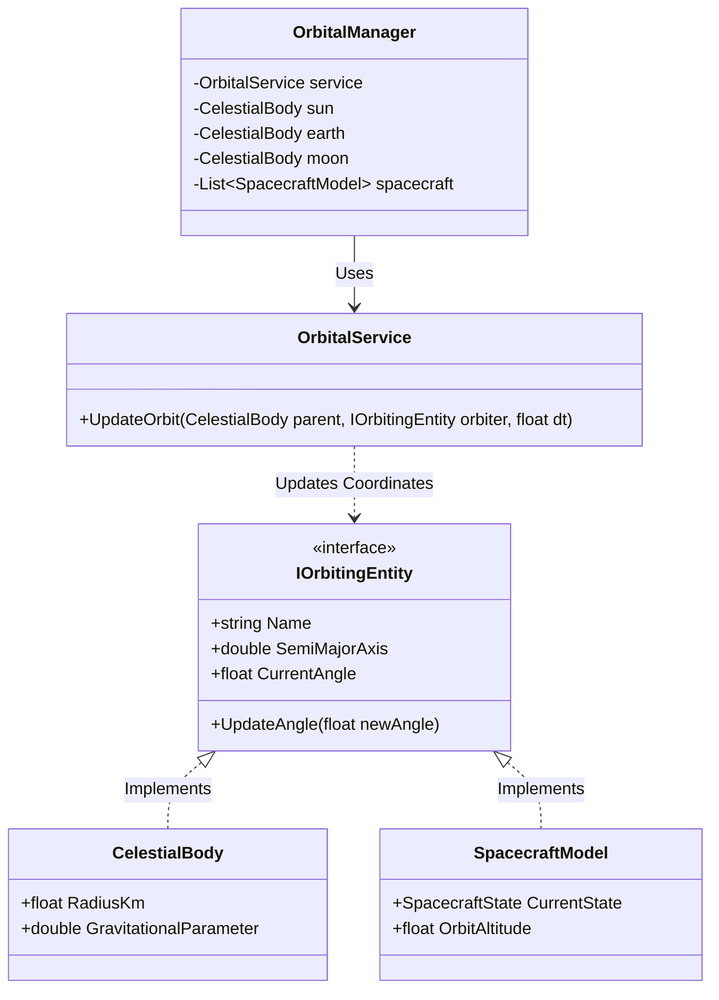
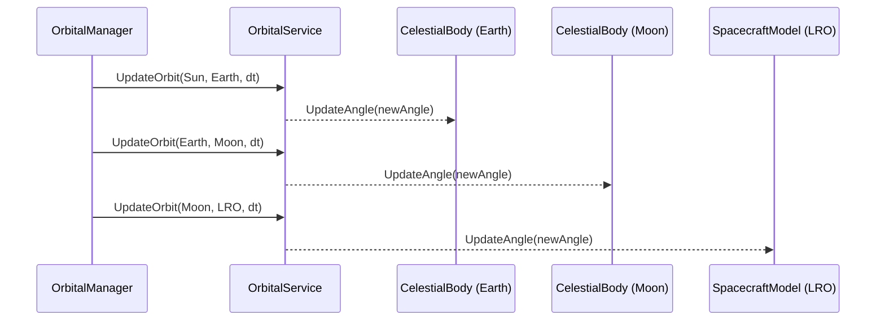

# Explanation: Lunar Mission Model Architecture

This document describes the architectural design, interfaces, and classes governing orbital simulation in the project. It outlines the responsibilities of the data models and execution managers.

---

## 1. Unified Interface Strategy

To ensure consistency between simulated celestial systems (e.g., Earth, Moon) and player-controlled assets (e.g., satellites, probes), we use a shared interface.

### The Interface: [IOrbitingEntity](file:///home/hp_prodesk/src/moonfall/Assets/Scripts/Simulation/IOrbitingEntity.cs)
Any entity that exhibits circular orbital behavior around a parent mass must implement this interface:

*   **`Name` (string):** Identifies the entity.
*   **`SemiMajorAxis` (double):** Distance from the center of the orbited parent body in kilometers.
*   **`CurrentAngle` (float):** Position of the entity along the orbit path in radians ($0$ to $2\pi$).
*   **`UpdateAngle(float newAngle)` (void):** Callback interface to apply the stepped calculation from the physics service.

---

## 2. Refined Domain Models

### A. [CelestialBody](file:///home/hp_prodesk/src/moonfall/Assets/Scripts/Simulation/CelestialBody.cs)
*   **Role:** Holds static mass properties ($GM$, Radius) of a planet, moon, or star. If the body orbits another mass (e.g., Moon orbiting Earth), it implements `IOrbitingEntity`.
*   **Key Properties:**
    *   `RadiusKm` (float)
    *   `GravitationalParameter` (double) - The standard GM factor.

### B. [SpacecraftModel](file:///home/hp_prodesk/src/moonfall/Assets/Scripts/Simulation/SpacecraftModel.cs)
*   **Role:** Represents player-deployed assets. When its state is set to `SpacecraftState.Orbiting`, it exposes parameters using `IOrbitingEntity`.
*   **Key Properties:**
    *   `OrbitAltitude` (float) - Height in kilometers above the lunar surface.
    *   `CurrentState` (SpacecraftState) - State Machine indicator (`InTransit`, `Orbiting`, `Landed`, `Roving`).

---

## 3. Services and Managers

### A. [OrbitalMath](file:///home/hp_prodesk/src/moonfall/Assets/Scripts/Simulation/OrbitalMath.cs) (Stateless Utility)
*   Provides raw, stateless Keplerian and Newtonian equations:
    *   `CalculateOrbitPeriod(double semiMajorAxis, double parentGM)`: Returns orbit period in seconds.
    *   `CalculateOrbitalSpeed(double semiMajorAxis, double parentGM)`: Returns orbital velocity in km/s.

### B. [OrbitalService](file:///home/hp_prodesk/src/moonfall/Assets/Scripts/Simulation/OrbitalService.cs) (Domain Business Service)
*   Translates model instances and interface representations to pass values into `OrbitalMath` equations.
*   **Key Method:**
    *   `UpdateOrbit(CelestialBody parentBody, IOrbitingEntity orbitingEntity, float deltaTime)`: Computes the next angular step for any `IOrbitingEntity` and updates its angle state.

### C. [OrbitalManager](file:///home/hp_prodesk/src/moonfall/Assets/Scripts/Controllers/OrbitalManager.cs) (Unity Game Loop Interface)
*   A `MonoBehaviour` script that acts as the entry point in the scene, coordinating system hierarchies and executing step updates inside the Unity `Update()` cycle.

---

## 4. Class Association Diagram

This diagram visualizes how the interface decouples the mathematics from specific game domain representations:

---

## 5. System Execution Sequence

Detailing how the `OrbitalManager` steps both the planetary system coordinates and the user's LRO satellite using the unified `UpdateOrbit()` signature:

