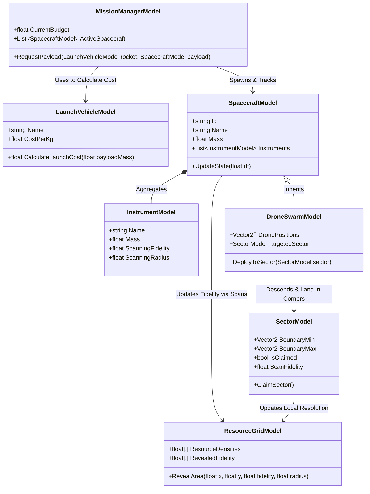

# Explanation: Core Simulation Models

This document serves as the main registration and tracking archive for our core game simulation models. These models represent the entities, attributes, and relationships necessary to support lunar exploration, payload delivery, science instrumentation, and resource mapping.

---

## 1. Model Definitions & Properties

### A. [LaunchVehicleModel](file:///home/hp_prodesk/src/moonfall/Assets/Scripts/Simulation/LaunchVehicleModel.cs)
*   **Role:** Computes transit costs and payload constraints from Earth to Trans-Lunar Injection (TLI).
*   **Properties:**
    *   `Name` (string): Rocket model name.
    *   `CostPerKg` (float): Cost rate to deliver payload to space.
*   **Methods:**
    *   `CalculateLaunchCost(float payloadMass)`: Returns the total launch cost.

### B. [SpacecraftModel](file:///home/hp_prodesk/src/moonfall/Assets/Scripts/Simulation/SpacecraftModel.cs)
*   **Role:** Represents any spacecraft (lander, rover, orbiter) deployed to the Moon.
*   **Properties:**
    *   `Id` (string): Unique identifier.
    *   `Name` (string): Designation of the craft.
    *   `Mass` (float): Structural and dry mass of the vehicle.
    *   `Instruments` (List<InstrumentModel>): Science instrumentation package equipped.
*   **Methods:**
    *   `UpdateState(float dt)`: Steps the internal simulation (battery drain, scanning states).

### C. [InstrumentModel](file:///home/hp_prodesk/src/moonfall/Assets/Scripts/Simulation/InstrumentModel.cs)
*   **Role:** Represents individual scientific detectors or sensors mounted on spacecraft.
*   **Properties:**
    *   `Name` (string): Instrument identifier (e.g., LOLA, LEND).
    *   `Mass` (float): Physical weight in kilograms (adds to spacecraft total launch mass).
    *   `ScanningFidelity` (float): Resolution rating of scans (0.0 to 1.0).
    *   `ScanningRadius` (float): Operational scanning coverage range.

### D. [ResourceGridModel](file:///home/hp_prodesk/src/moonfall/Assets/Scripts/Simulation/ResourceGridModel.cs)
*   **Role:** Stores the topological database of resources and controls how scans reveal information to the player.
*   **Properties:**
    *   `ResourceDensities` (float[,]): Raw density metrics at grid coordinates.
    *   `RevealedFidelity` (float[,]): Current definition level of player scans at grid coordinates.
*   **Methods:**
    *   `RevealArea(float x, float y, float fidelity, float radius)`: Processes and overlays scan data to increase local visual fidelity.

### E. [MissionManagerModel](file:///home/hp_prodesk/src/moonfall/Assets/Scripts/Simulation/MissionManagerModel.cs)
*   **Role:** Coordinates overall fleet operations, system budgets, and launch request sequences.
*   **Properties:**
    *   `CurrentBudget` (float): Dynamic cash reserve available.
    *   `ActiveSpacecraft` (List<SpacecraftModel>): All spacecraft active in orbit or on the surface.
*   **Methods:**
    *   `RequestPayload(LaunchVehicleModel rocket, SpacecraftModel payload)`: Validates budget requirements and adds spacecraft to transit.

### F. [DroneSwarmModel](file:///home/hp_prodesk/src/moonfall/Assets/Scripts/Simulation/DroneSwarmModel.cs)
*   **Role:** Represents a composite swarm of 4 propulsive hopping drones designed to scan and claim sectors.
*   **Properties:**
    *   `DronePositions` (Vector2[]): Surface coordinates of the 4 independent sub-units.
    *   `TargetedSector` (SectorModel): The specific map sector assigned for landing and deployment.
*   **Methods:**
    *   `DeployToSector(SectorModel sector)`: Triggers descent coordinates calculations.

### G. [SectorModel](file:///home/hp_prodesk/src/moonfall/Assets/Scripts/Simulation/SectorModel.cs)
*   **Role:** Represents a defined territory boundary segment on the lunar surface.
*   **Properties:**
    *   `BoundaryMin` (Vector2): South-West corner coordinate boundary.
    *   `BoundaryMax` (Vector2): North-East corner coordinate boundary.
    *   `IsClaimed` (bool): Status indicating if construction is unlocked.
    *   `ScanFidelity` (float): Mapping completion rating for this sector (0.0 to 1.0).
*   **Methods:**
    *   `ClaimSector()`: Finalizes the claim state and unlocks localized construction utilities.

---

## 2. Core Model Association Diagram

This class diagram documents how the core simulation systems aggregate and interact:

