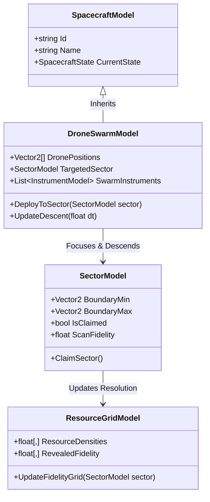
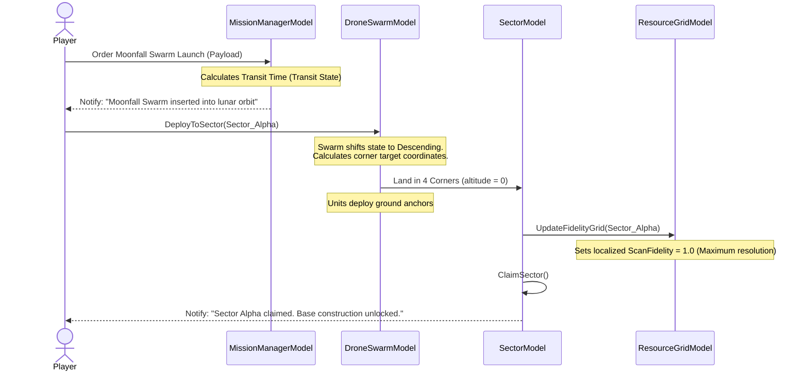

# Explanation: Moonfall Drone Swarm Architecture

This document describes the architectural specifications, user-flows, and class relationships for the Moonfall drone swarm deployment and sector-claiming mechanics.

---

## 1. System Overview

The Moonfall Drone Swarm represents a late-game, high-fidelity mapping asset. Instead of operating as a single localized probe or orbiter, it operates as a coordinated swarm of 4 mobile units. 

Its primary gameplay objective is to allow the player to **claim a land sector** for construction by conducting a definitive high-resolution survey of the sector's corners.

---

## 2. Model Structure (Class Diagram)

This class diagram details the properties and methods used to orchestrate the swarm descent and coordinate mapping:

---

## 3. User-Flow and Deployment Sequence

The sequence below tracks the lifecycle of the swarm from ordering, through transit and orbit, to localized landing and sector claiming:

---

## 4. Architectural Rules for Swarm Implementation

To ensure strict separation of concerns following our MVP guidelines:
1.  **Physics Decoupling:** The descent physics (ballistic path calculation to the corners) must be processed by the [OrbitalService](file:///home/hp_prodesk/src/moonfall/Assets/Scripts/Simulation/OrbitalService.cs) using formulas in [OrbitalMath.cs](file:///home/hp_prodesk/src/moonfall/Assets/Scripts/Simulation/OrbitalMath.cs).
2.  **State Constraints:** The `DroneSwarmModel` must not allow deployment to a sector that is already claimed or falls outside the active orbital path of the spacecraft.
3.  **UI Updates:** The transition from Low-Fidelity scanning to High-Fidelity scanning on the player's screen must be handled by the Presenter listening to the `OnMapUpdated` event fired by the `ResourceGridModel`.
