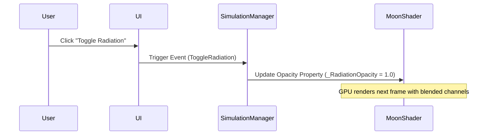

# Explanation: Wiki Integration and Diagramming Strategy

This document explains the design decisions and architectural rationale for using version-controlled markdown repositories alongside GitHub/GitLab Wikis to document the Moon Simulation project.

---

## 1. The Problem: Documentation Drift
In software projects, architecture diagrams and documentation stored in external systems (like Google Docs or Confluence) quickly drift from the actual codebase. As code updates, diagrams are forgotten because they require separate tools to edit and publish.

---

## 2. The Solution: Documentation as Code (DaC)
To solve this, we store documentation as plain text Markdown files (`.md`) directly in the project repository under the `/docs` directory. This provides several benefits:
*   **Version Control:** Documentation changes are reviewed and merged in the same pull requests as the code.
*   **Plain Text Portability:** Diagrams are written in **Mermaid.js**, a text-to-diagram markup language. This means diagrams can be version-controlled, diffed, and edited in any text editor without relying on proprietary image editors.

---

## 3. GitHub/GitLab Wiki Integration
While the source code repository holds the authoritative documentation, team members and external stakeholders need a readable interface. GitHub and GitLab provide native Wiki systems.

### Dual-Repository Mirroring (Recommended Setup)
GitHub Wikis are actually separate Git repositories hidden behind the main repository interface. The remote address follows this pattern:
*   **Main Repo:** `git@github.com:username/repository.git`
*   **Wiki Repo:** `git@github.com:username/repository.wiki.git`

This architecture allows developers to automatically sync the contents of the `/docs` folder to the Wiki using a simple Git synchronization script or a CI/CD pipeline (e.g., GitHub Actions). This ensures that every commit merged into the `main` branch automatically updates the public-facing Wiki.

---

## 4. Diagramming with Mermaid.js
Instead of saving PNGs or SVGs of diagrams, we embed raw Mermaid code blocks directly in the markdown. The GitHub/GitLab Wiki engine renders these code blocks into interactive SVGs automatically on page load.

### Example: System State Flow

This diagram is rendered dynamically from plaintext, meaning it can be edited by any developer in seconds simply by modifying the text block.
