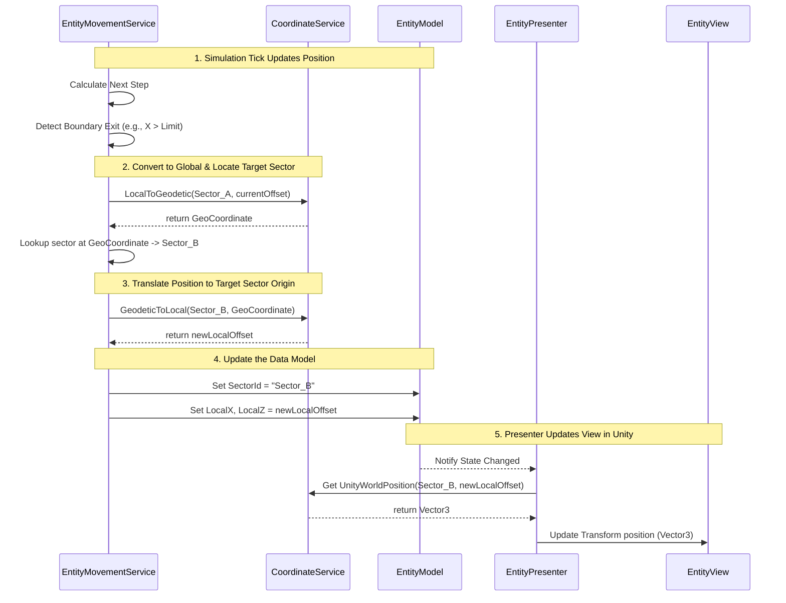

# Reference: Lunar Surface Geodetic and Game Model Standards

This document establishes the real-world geodetic standards used by planetary agencies (NASA PDS) alongside the coordinate and terminology standards defined for the Moon Simulation game.

---

## 1. Real-World Geodetic Reference Data (NASA PDS)

To keep physical calculations realistic and ensure compatibility with planetary GIS datasets (such as LRO LOLA/LROC), the simulation adheres to the following planetary standards:

| Parameter | Value / Standard | Description |
| :--- | :--- | :--- |
| **Reference System** | Mean Earth/Polar Axis (ME) | The IAU-approved coordinate reference frame for lunar cartography. |
| **Coordinate Format** | Planetocentric Coordinates | Coordinates are computed from the Moon's center of mass. |
| **Latitude Range** | $-90.0^{\circ}$ to $+90.0^{\circ}$ | Decimal degrees. negative represents South, positive represents North. |
| **Longitude Range** | $0.0^{\circ}$ to $360.0^{\circ}$ | Decimal degrees. Measured continuously in the Eastern direction. |
| **Lunar Mean Radius** | $1737.4\text{ km}$ | The base spherical datum. Altitudes are expressed as offsets from this radius. |
| **Physical Units** | Metric SI System | Lengths are in meters/kilometers; mass in kilograms; time in seconds. |

---

## 2. In-Game Model Terminology

These defined terms map geographical GIS dataset boundaries to localized Unity game world coordinate spaces:

*   **Global Geodetic Coordinate (`GeoCoordinate`):** A location defined by `Latitude` (decimal degrees, $-90.0$ to $90.0$) and `Longitude` (decimal degrees, $0.0$ to $360.0$).
*   **Altitude / Elevation (`Elevation`):** The height offset in meters ($m$) relative to the base lunar radius sphere ($1737.4\text{ km}$).
*   **Sector (`Sector`):** A bounded geographical coordinate block (e.g., $1^{\circ} \times 1^{\circ}$ square) representing a building and exploration zone.
*   **Local Metric Coordinate (`LocalOffset`):** Metrical offsets $(x, z)$ measured in meters from a sector's customized origin point (the southwest corner), used to place structures inside Unity scenes.
*   **Tile / Cell (`GridCell`):** The atomic resolution unit of the terrain database, representing a single pixel on heightmap or resource textures.

---

## 3. Data Hierarchy & Streaming Logic

To simulate the entire Moon down to meter-scale construction details, the game utilizes a single **unified hierarchical database** representing three scales:

1.  **Macro Scale (The Globe):** Lower-resolution planet-wide heights and albedo mapping. Always kept in RAM for global camera views.
2.  **Medium Scale (Sectors):** Bounded geographical regions ($1.0^{\circ} \times 1.0^{\circ}$). Loaded as separate nodes.
3.  **Micro Scale (Grid Cells):** Metrical grid cells inside a Sector. Dynamically loaded/unloaded from disk on demand.

---

## 4. Quadtree Data Structure Models

The Moon is mathematically modeled as a cube with 6 faces, where each face is the root of a Quadtree structure. 

### A. The Quadtree Node Model: [LunarQuadtreeNode](file:///home/hp_prodesk/src/moonfall/Assets/Scripts/Simulation/LunarQuadtreeNode.cs)
*   **Role:** Represents a branch in the spatial directory. It is recursively subdivided as the player zooms in.
*   **Properties:**
    *   `int Depth` (0 = Face root, 5 = Individual Sector level)
    *   `GeoCoordinate Center`
    *   `GeoCoordinate BoundaryMin`, `GeoCoordinate BoundaryMax`
    *   `LunarQuadtreeNode[] Children` (4 sub-nodes, null if leaf node)
    *   `Sector SectorData` (Only initialized on leaf nodes when streamed in)

### B. The Sector Model: [Sector](file:///home/hp_prodesk/src/moonfall/Assets/Scripts/Simulation/Sector.cs)
*   **Role:** The playable territory container. It maps geographical boundaries to flat coordinates.
*   **Properties:**
    *   `string SectorId`
    *   `GeoCoordinate Origin` (South-West corner, maps to Unity local coordinates `Vector3.zero`)
    *   `GridCell[,] Grid` (2D grid of atomic tiles)
    *   `bool IsLoaded`

### C. The Grid Cell Model: [GridCell](file:///home/hp_prodesk/src/moonfall/Assets/Scripts/Simulation/GridCell.cs)
*   **Role:** Represents the micro-scale data cell.
*   **Properties:**
    *   `LocalOffset Offset` (meters from the Sector origin)
    *   `float Elevation` (height offset in meters)
    *   `float WaterIceDensity` (0.0 to 1.0)
    *   `float TitaniumDensity` (0.0 to 1.0)

---

## 5. Simulation Services

The loading, unloading, and coordination of high-fidelity spatial data is managed by dedicated C# services.

### A. The Streaming Service: [TerrainStreamingService](file:///home/hp_prodesk/src/moonfall/Assets/Scripts/Simulation/TerrainStreamingService.cs)
*   **Role:** Reads camera coordinates and dynamically manages node allocations in the Quadtree.
*   **Methods:**
    *   `EvaluateLoadRequirements(GeoCoordinate cameraLookAt, float cameraAltitude)`: Recursively walks the quadtree. Determines which nodes require subdivision or merging based on distance.
    *   `LoadSectorData(LunarQuadtreeNode leafNode)`: Asynchronously reads heightmap (LOLA DEM) and resource segments from storage and instantiates the `Sector` data.
    *   `UnloadSectorData(LunarQuadtreeNode leafNode)`: Discards the `GridCell` array from memory to free up RAM when the camera moves away.

### B. The Coordinate Service: `CoordinateService`
*   **Role:** Translates coordinates between local meters (`LocalOffset`) and global angles (`GeoCoordinate`).
*   **Methods:**
    *   `LocalToGeodetic(Sector sector, LocalOffset localPos)`: Returns the global `GeoCoordinate` for a position inside a sector.
    *   `GeodeticToLocal(Sector sector, GeoCoordinate geoPos)`: Returns the `LocalOffset` inside a sector for a global coordinate.

---

## 6. Game-World Coordinate Hierarchy

### A. Local Metric Coordinate (`LocalOffset`)
*   **Scale:** Micro Scale (Inside a single playable Sector).
*   **Definition:** A flat, 2D coordinate $(x,z)$ measured in meters from a Sector's designated origin point (the southwest corner, which represents $(0,0)$).
*   **Example:** Placing a Solar Panel at local position $(x = 45.0\text{ m}, z = 120.5\text{ m})$ relative to the bottom-left corner of Sector `SEC-402`.

### B. Global Geodetic Coordinate (`GeoCoordinate`)
*   **Scale:** Macro Scale (The entire lunar globe).
*   **Definition:** An angular coordinate pair (Latitude, Longitude) in degrees representing a physical point on the spherical Moon.
*   **Example:** The Shackleton Crater (a key resource site at the South Pole) is located at:
    *   `Latitude = -89.9°`
    *   `Longitude = 0.0°`

### C. Unity Engine Coordinate (`Vector3` / World Position)
*   **Scale:** View Scale (Rendering and physics engine).
*   **Definition:** A 3D Cartesian vector $(X, Y, Z)$ in Unity world space, representing the virtual position of a rendered GameObject inside the virtual environment volume.
*   **Architectural Scope (MVP Boundary):** These coordinates are strictly utilized in the **View** and **Presenter** layers of the Model-View-Presenter (MVP) architecture. The simulation **Model** remains completely decoupled from Unity, containing no `UnityEngine` references or `Vector3` coordinate types.

### D. The Cubed-Sphere: The Indexing & Projection Layer
*   **Location in Hierarchy:** Between the Global Geodetic Coordinate (Macro) and the Sector (Medium).
*   **Role:** It functions as the mathematical bridge that maps the spherical globe to flat data structures.
*   **How it is used:** Instead of calculating positions on a curved sphere, the database uses the 6 faces of the Cubed-Sphere to organize the Quadtree loading system. It decides which physical regions to load into the active space.

### E. The Grid-Cell: The Atomic Resolution Layer
*   **Location in Hierarchy:** Below the Local Metric Coordinate (Micro).
*   **Role:** It is the smallest unit of physical data (the "pixels" of the simulation).
*   **How it is used:** A `GridCell` sits inside a Sector's coordinate system. It does not define its own location; rather, it is indexed at a specific row and column of a 2D matrix inside the Sector. It holds local attributes like elevation and resource density for that specific metric spot.

### F. Hierarchy Visual Diagram (Top-to-Bottom)
1.  **Global Geodetic Coordinate (Lat/Lon):** The physical Moon sphere.
2.  **Cubed-Sphere Projection (Cube Face + Quadtree):** The database divider (tells the game what to load).
3.  **Sector Origin Coordinate (Lat/Lon corner anchor):** The local game-board boundary.
4.  **Local Metric Coordinate (Meters offset from corner):** Where objects and buildings sit.
5.  **Grid-Cell (Row/Col index):** The resource and elevation data at that spot.

### G. Architectural Allocation of the Hierarchy

Here is how the hierarchy levels are divided architecturally between **Models** and **Services**:

#### 1. Stored in Individual Entity Models (e.g., Buildings, Drones)
*   **Level 4: Local Metric Coordinate (Meters offset):**
    *   *Why:* Each building, drone, or mining outpost model must store its local metric coordinates ($(x,z)$ offsets) so the game knows exactly where it is placed on the playable board and can compute local collisions.

#### 2. Necessary for the Model of the Lunar Surface/Globe
*   **Level 3: Sector Origin Coordinate (Lat/Lon anchor):**
    *   *Why:* The [Sector](file:///home/hp_prodesk/src/moonfall/Assets/Scripts/Simulation/Sector.cs) data model stores its own Southwest origin point to anchor itself to a specific physical location on the spherical Moon.
*   **Level 5: Grid-Cell (Row/Col index):**
    *   *Why:* The [Sector](file:///home/hp_prodesk/src/moonfall/Assets/Scripts/Simulation/Sector.cs) model stores the 2D grid matrix of [GridCell](file:///home/hp_prodesk/src/moonfall/Assets/Scripts/Simulation/GridCell.cs) objects containing the raw terrain elevation, albedo, and resource densities.

#### 3. Calculated by a Service Class
*   **Level 1: Global Geodetic Coordinate (Lat/Lon):**
    *   *Calculated by:* A coordinate conversion utility service.
    *   *Why:* Calculated dynamically. An entity's global geodetic coordinate is derived by taking its Level 4 local offset and combining it with the Sector's Level 3 origin.
*   **Level 2: Cubed-Sphere Projection (Cube Face + Quadtree):**
    *   *Calculated by:* [TerrainStreamingService](file:///home/hp_prodesk/src/moonfall/Assets/Scripts/Simulation/TerrainStreamingService.cs).
    *   *Why:* The complex math that maps spherical coordinates to the 6 faces of the cubed-sphere, evaluates camera distances, and triggers the loading/unloading of quadtree sectors is handled entirely by this runtime business service.

#### Architectural Allocation Reference Table

| Hierarchy Level | Primary Code Owner | Architectural Layer | Primary Unit / Coordinate System |
| :--- | :--- | :--- | :--- |
| **1. Global Geodetic** | `CoordinateService` | Service (Business Logic) | Geodetic Angular Degrees (Latitude, Longitude) |
| **2. Cubed-Sphere** | `TerrainStreamingService` | Service (Data Streaming) | Cube Face ID + Normalized 2D Quadtree Nodes |
| **3. Sector Origin** | `Sector` | Model (Data Structure) | Geodetic Coordinates (Southwest Corner Datum) |
| **4. Local Metric** | `DroneModel`, `BuildingModel` | Model (Individual Entities) | 2D Metric Offsets (meters $x, z$) |
| **5. Grid-Cell** | `GridCell` | Model (Atomic Data Cell) | 2D Matrix Index (row, column) + Local Offset |

#### H. Property Mapping and Data Types

| Hierarchy Level | Owner Model/Class | Property Name | C# Data Type | Description |
| :--- | :--- | :--- | :--- | :--- |
| **1. Global Geodetic** | *None (Calculated)* | `GeoCoordinate` | `struct GeoCoordinate` | Represents Latitude and Longitude angles. |
| **2. Cubed-Sphere** | `LunarQuadtreeNode` | `Depth` `BoundaryMin` `BoundaryMax` | `int` `GeoCoordinate` `GeoCoordinate` | Subdivision level and angular boundaries. |
| **3. Sector Origin** | `Sector` | `SectorId` `Origin` | `string` `GeoCoordinate` | Unique identifier and Southwest corner datum. |
| **4. Local Metric** | `DroneModel` `BuildingModel` | `SectorId` `LocalX` `LocalZ` | `string` `float` `float` | Parent sector ID and metrical coordinates (offsets in meters). |
| **5. Grid-Cell** | `GridCell` | `Offset` `Elevation` | `LocalOffset` | Metric offset coordinate and altitude value. |
| **View (Rendering)** | `Transform` (Unity) | `position` | `Vector3` | Cartesian position vector in Unity World Space. |

---

## 7. Sector-to-Sector Movement Transaction Flow

This section details the runtime flow of information when a simulated movable entity crosses a Sector boundary.

### A. Process Steps
1.  **Movement Step:** The `EntityMovementService` calculates the entity's next position offset during the simulation tick.
2.  **Boundary Check:** The service detects that the local metric coordinate has crossed outside the $1^{\circ} \times 1^{\circ}$ boundaries of Sector A (e.g., local $X > \text{Sector Width}$).
3.  **Global Position Query:** The service calls the `CoordinateService` to translate the entity's local offset in Sector A into a global `GeoCoordinate` (Latitude, Longitude).
4.  **Target Sector Lookup:** The service passes the global `GeoCoordinate` to the quadtree index to find which Sector now contains this coordinate, identifying **Sector B**.
5.  **Coordinate Translation:** The service calls the `CoordinateService` to translate the global `GeoCoordinate` back into a local metric coordinate *relative* to Sector B's origin.
6.  **Model State Update:** The service updates the properties on the `EntityModel` directly (setting `SectorId = "Sector_B"` and updating the local $(x, z)$ metric coordinates).
7.  **Presenter Notification:** The `EntityPresenter` observes this model update, calculates the new `Vector3` position in Unity World Space, and updates the `EntityView` transform.

### B. Sequence Diagram

