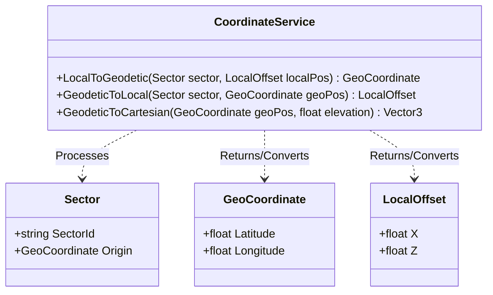
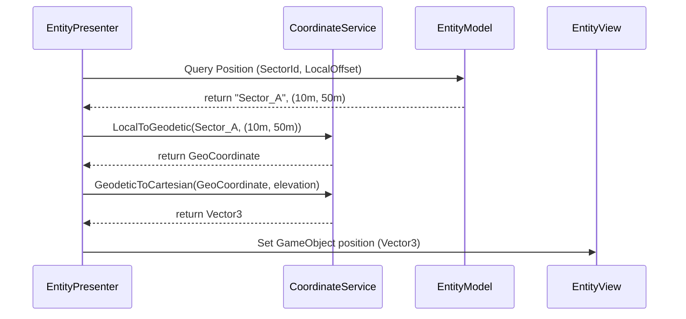

# Reference: Coordinate Service Specification

The `CoordinateService` is a stateless utility service responsible for translating coordinates between the distinct scales of the simulation: local metrics, global geodetic angles, and virtual Unity coordinates.

---

## 1. Interface and Methods

### Class: `CoordinateService`

*   **`LocalToGeodetic(Sector sector, LocalOffset localPos) : GeoCoordinate`**
    *   *Role:* Translates a 2D metric offset from a specific sector's Southwest origin into a global Latitude/Longitude coordinate.
*   **`GeodeticToLocal(Sector sector, GeoCoordinate geoPos) : LocalOffset`**
    *   *Role:* Translates a global Latitude/Longitude coordinate into a 2D metric offset relative to the target sector's Southwest origin.
*   **`GeodeticToCartesian(GeoCoordinate geoPos, float elevation) : Vector3`**
    *   *Role:* Projects a spherical geodetic coordinate and altitude into 3D Cartesian coordinates. Note: This method is bridging the Model-View boundary and is primarily consumed by Presenters to set Unity positions.

---

## 2. Class Diagram

---

## 3. Translation Sequence

Shows how the `EntityPresenter` utilizes the `CoordinateService` to position a newly spawned entity in Unity World Space:

