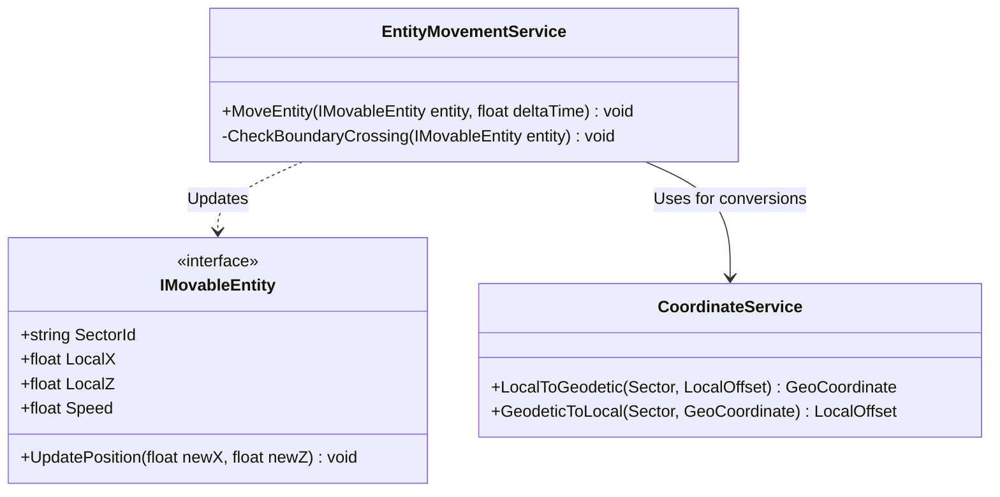
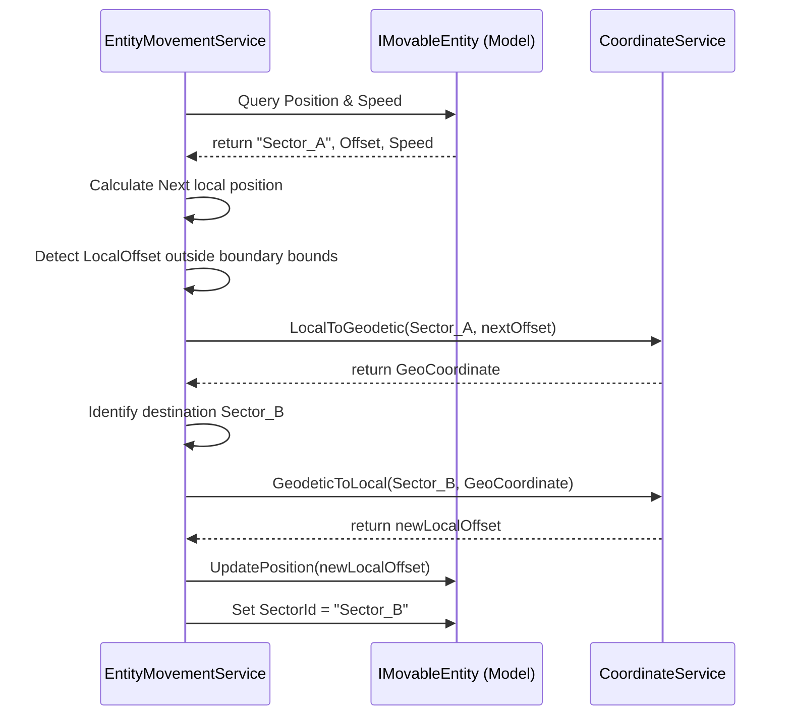

# Reference: Entity Movement Service Specification

The `EntityMovementService` handles physics step updates for movable entities (Drones, Rovers) on the lunar surface, calculating speeds and performing sector boundary transfers.

---

## 1. Interface and Methods

### Class: `EntityMovementService`

*   **`MoveEntity(IMovableEntity entity, float deltaTime) : void`**
    *   *Role:* Steps the entity along its target path, adjusting its metric offsets.
*   **`CheckBoundaryCrossing(IMovableEntity entity) : void`**
    *   *Role:* Evaluates whether the entity's new metric offsets have exceeded its current Sector boundary limits.

---

## 2. Class Diagram

---

## 3. Movement and Boundary Crossing Sequence

Detailed sequence showing how movement ticks are processed and sector boundaries resolved:

