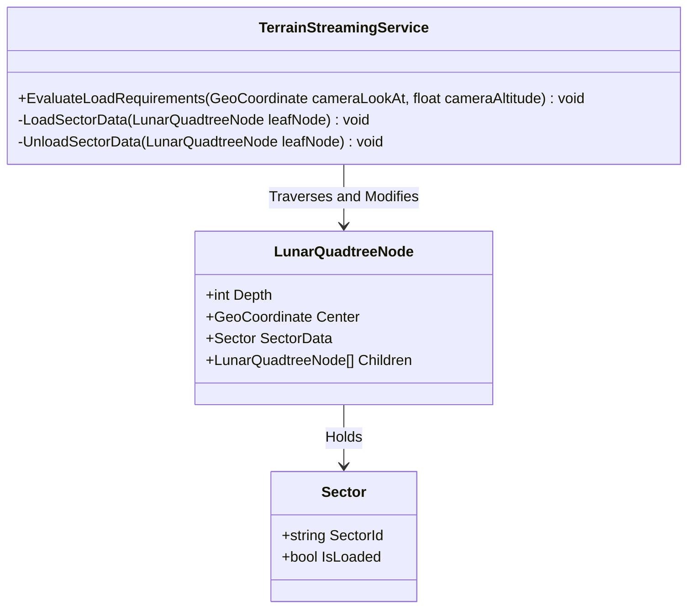

# Reference: Terrain Streaming Service Specification

The `TerrainStreamingService` handles level-of-detail (LOD) database loading and unloading. It monitors camera positions, traverses the lunar quadtree, and manages sector RAM allocations.

---

## 1. Interface and Methods

### Class: `TerrainStreamingService`

*   **`EvaluateLoadRequirements(GeoCoordinate cameraLookAt, float cameraAltitude) : void`**
    *   *Role:* Traverses the 6 quadtree roots, subdividing or merging nodes depending on camera distance and altitude.
*   **`LoadSectorData(LunarQuadtreeNode leafNode) : void`**
    *   *Role:* Reads heightmap and resource textures from storage, instantiates the `Sector` data model, and links it to the leaf node.
*   **`UnloadSectorData(LunarQuadtreeNode leafNode) : void`**
    *   *Role:* Discards grid cell arrays and sector references from memory when the camera leaves the zone, freeing up system RAM.

---

## 2. Class Diagram



---

## 3. Streaming Sequence

This sequence outlines the check and load execution flow during the game update loop:

```mermaid
sequenceDiagram
    participant Loop as Unity Update Loop
    participant TSS as TerrainStreamingService
    participant Node as LunarQuadtreeNode
    participant Disk as Storage (Disk)

    Loop->>TSS: EvaluateLoadRequirements(camLookAt, camAltitude)
    TSS->>Node: Distance Check (Camera to Node Center)
    alt Node needs subdivision (Zoomed In)
        TSS->>Node: Subdivide into 4 Children
    else Node is Leaf and within range
        TSS->>TSS: LoadSectorData(Node)
        TSS->>Disk: Async Read Heightmap/Resource Maps
        Disk-->>TSS: return raw float arrays
        TSS->>Node: Instantiate and link SectorData
    else Node is out of range
        TSS->>TSS: UnloadSectorData(Node)
        TSS->>Node: Clear SectorData reference (Garbage Collect)
    end
```
